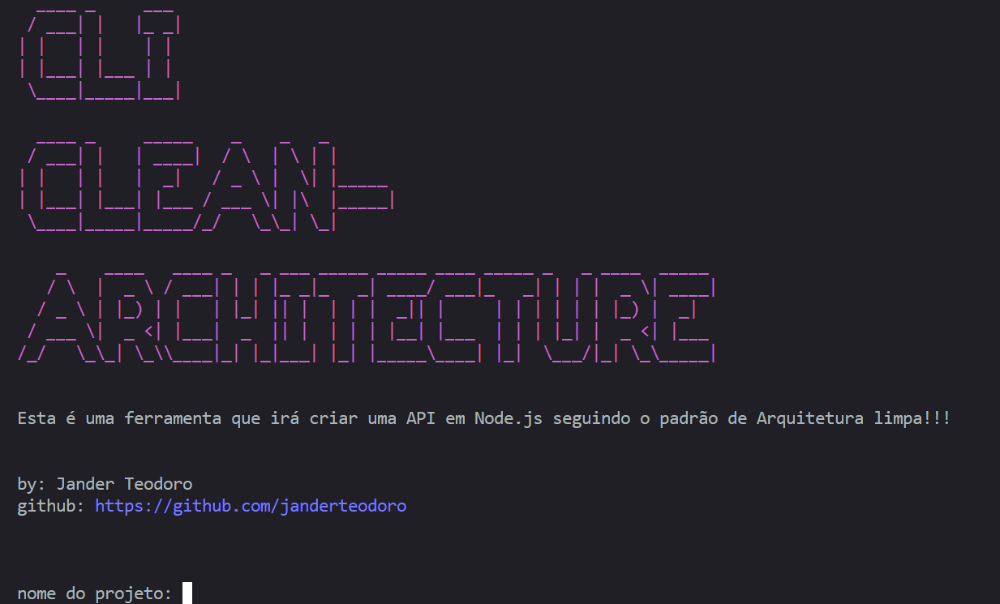
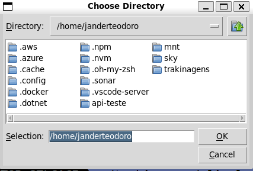
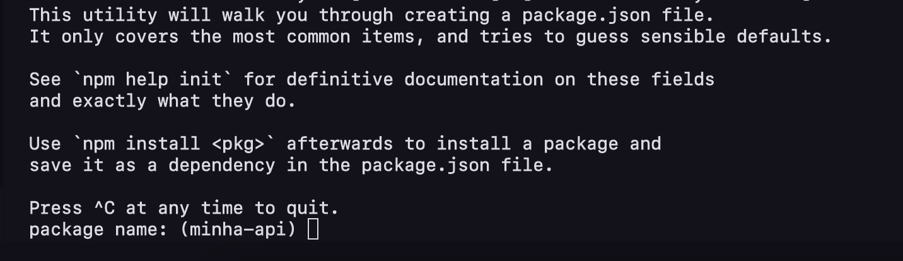

# CLI-CLEAN-ARCHITECTURE

Este projeto consiste em uma CLI que monta uma base de um microsserviço em **Node.js** já na arquitetura exagonal:

## Como rodar localmente
Trata-se de um projeto em Python, portanto para que você consiga instalar e utilizar essa ferramenta, é necessário que tenha o Python 3 instalado com o virtualenv. Caso não tenha pode encontrar aqui no [site oficial](python.org) do Python. 
Após instalar siga os seguintes passos: 
1. Clone o repositorio -> `https://github.com/janderteodoro/cli-clean-architecture.git`
2. Crie um ambiente virtual -> `python3 -m venv venv`
3. Ative o ambiente virtual ->  `source venv/bin/activate`
4. Instale as dependências -> `pip install -r requirements.txt`
5. Execute o script main.py -> `python3 cli/main.py`

## Casos de uso
- Após rodar a CLI. irá se deparar com a seguinte tela:  

- Então inserimos o nome do nosso projeto

- O CLI irá abrir o finder para que escolha a pasta de destino  

- Após escolher a pasta, voltamos para o terminal onde continuará todo o processo de instalação das libs e etc...  

- Então navegue até o diretório que criou seu projeto e abra ele no vscode com  `code <nome-da-sua-api>`
- Insira o script `start`dentro do **package.json** -> `"start": "node src/bin/www"`, ficando da seguinte forma:  

- Ao executar terá o seguinte resultado, caso ainda não tenha colocado suas envs:  

- Após inserir irá logar apenas `node ./src/bin/www`